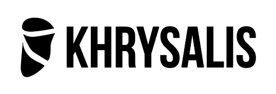

# Khrysalis

This is synced



By [Lightning Kite](https://lightningkite.com)

Khrysalis is a low-commitment multiplatform application development system based on converting Android apps into iOS apps.

Khrysalis is actively being used by Lightning Kite to develop apps that are soon to reach production, and is still regularly receiving major upgrades.

Khrysalis is fully open-sourced under the MIT license.

## Benefits

- Results in two entirely separate codebases - one in Kotlin for Android, and one in Swift for iOS.  If you want to back out of using Khrysalis, you can do so at any time, just using some basic library pieces from it instead.
- Gradual introduction into codebase, as existing code can be used with new translated code.
- Rapid prototyping, allowing a full click-through app to be created with just XML.
- Full underlying platform access - since you use the underlying languages in their native environments, using native libraries is extremely simple.
- Easy to learn for existing mobile devs, as the core language is Kotlin and you mostly just use normal Kotlin tools.
- Leverages the long-used Rx set of libraries, [RxJava](https://github.com/ReactiveX/RxJava) and [RxSwift](https://github.com/ReactiveX/RxSwift), for observable-based programming

## What actually is it?

A transpiler between Kotlin and Swift with an emphasis on readability over supporting all Kotlin features.

Also includes a runtime for iOS in order to make compilation easier, which over time is being reduced in size.

## What code can I share between Android and iOS?

You can share almost all Kotlin code that:
- uses declarations that have the same signature on both sides OR has translation information in the form of a YAML file
- doesn't rely on untranslatable generics, such as the use of `*` in a variable type
- doesn't use delegates (the `by` expression in a class header, may be supported in the future)

There are several libraries we use at Lightning Kite that are explicitly Khrysalis supported.

- [RxKotlin Plus](https://github.com/lightningkite/rxkotlin-plus) and [RxSwift Plus](https://github.com/lightningkite/RxSwiftPlus)
- [Xml to Xib Converter](https://github.com/lightningkite/android-xml-to-ios-xib)

## What if I need to do something platform specific?

Cool!  That's easy - all you have to do is ensure there are same-signature declarations on both sides!

### Simple Example

Let's demonstrate the most basic example of exposing platform-specific code for shared use.  We start by making declarations in Android and iOS separately:

```kotlin
// File is greeting.kt
val greeting: String = "Welcome to the Android App!"
```

```swift
// File is greeting.swift
public let greeting: String = "Welcome to the iOS App!"
```

Now that the declarations match, we can access it in shared code:

```kotlin
// File is demo.shared.kt
// Files with '.shared.kt' at the end can be translated from Kotlin to Swift via a Gradle task
fun demo(){
    println("This is the demo for shared code.")
    println(greeting)
}
```

### Firebase Example

For example, let's say I want to use Firebase Realtime Database on both sides to simply set the user's name.  First, we:

- Set up the library on both apps as normal.
- Ensure the declarations you intend to use have the same signature on both sides, and if not, add stuff to make them match for what you need.

Based on reading the Firebase documentation, we'll make:

```kotlin
// File is MyFirebase.kt in the Android project
object MyFirebase {
    fun get(): DatabaseReference {
        return FirebaseDatabase.getInstance().reference
    }
}
```

```swift
// File is MyFirebase.swift in the iOS project
public class MyFirebase {
    private init(){}
    static func get() -> DatabaseReference {
        return Database.database().reference()
    }
}
```

Both sides already define the same signature functions for `DatabaseReference`, including `child(key)` and `setValue(String)`, so we don't have to do anything special to use those in shared code.

Now, in shared code file, we could do this:
```kotlin
// File is MyLogic.shared.kt in the Android Project
// Will get syntax-transformed upon running a task in the project.
fun updateUsersName(forUser: String, newName: String){
    MyFirebase.get().child("users").child(forUser).child("username").setValue(newName)
}
```

You'll likely find that *lots* of different libraries that have been written for both Android and iOS share a fairly similar API, and thus require little-to-no tweaking to be used.

## Usage

This library is published in Maven Central.

### Example Project

You can see [the example project here.](https://github.com/lightningkite/khrysalis-full-example)

### Usage in a project

In your Gradle file, add the following:

```kotlin
//Using Gradle Kotlin DSL

plugins {
    //...
    id("com.lightningkite.khrysalis")
}

//...

khrysalis {
    projectName = "MyProject"
    overrideIosFolder = project.rootDir.absoluteFile.resolve("../ios") // Path to iOS project root
}
```

You then need to provide paths to search for Swift equivalent files (ending in `swift.yaml`) that define how elements in Kotlin code are translated to Swift.

If you are on a Mac, the files are searched for based on your pods.  The equivalent files are expected to be in the iOS project and its dependencies.

If you are not on a Mac, you can manually define the paths to search in your `local.properties` folder as follows:

```properties
khrysalis.iospods=path:another/path:yet/another/path
```

### Available Gradle Tasks

- `khrysalisIos`
    - Completely converts the project to iOS.  Performs all of the following tasks:
        - `khrysalisConvertKotlinToSwift`
            - Converts Kotlin to Swift for any files with `.shared.kt` at the end or the `@SharedCode` annotation.
        - `khrysalisUpdateIosVersion`
            - Updates the version number/code in the iOS project to match this project.
